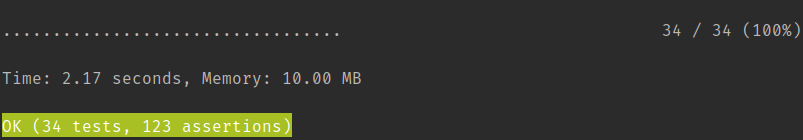

# Golf Dice Game

* [Problem Specification](./docs/dice-game-spec.pdf)

## Installation

* Ensure you have PHP 7.2
* Install [Composer](https://getcomposer.org/doc/00-intro.md) globally or locally
* To install the application requirements using globally installed composer, run: `composer install `

## Tests

### Running the Tests

* All test suites: `vendor/bin/phpunit`. 
* Acceptance tests: `vendor/bin/phpunit --testsuite Acceptance`
    * Asserts the functionality of `Interview::playGame()` as well as performs performance comparisons for different rolling strategies
* Unit tests: `vendor/bin/phpunit --testsuite Unit`
    * Tests the logic and interaction of the objects in the application

## Code Description

The entrypoint to fulfill the `playGame()` method requirement is `Interview::playGame()`.  From there the major classes
are Game, Round, and Player.  A Game runs `N` rounds where `N` is equal to the count of the number of 
players in the game (4 for our purposes by default).  A round is all players rolling once.  A player rolls until they have 
no more dice left to roll.  That is a max of 5 rolls since there are 5 di to roll.  

Round returns a Leaderboard object which shows the result of that round.  The Game object likewise returns a leaderboard
which is combined with the round leaderboards to create a combined score. 

A player can use one of a few different rolling strategies to choose the dice to keep for each roll. 
A roller class was extracted to test and to be able to mock the rolls as needed.  A `PlayerScore` is returned 
by the player classes.  

Game and Round both use a simple factory to create a few objects so that they can be mocked out easily.  

## Assumptions & Questions

* Are the business terms game & round?
    * I assumed so but would have checked before implementing
* made the assumption that it was ok to change `playGame()` to `play()`
    * I would always check with others before doing so
* Are the dice six sided and are they numbered from 1 through 6? 
    * I assumed so but would have checked before implementing
* Will the number of players ever need to be changed? 
    * I assumed so since it was very low cost to do so
* Is there a max number of players? 
    * I assume so but didn't put checks in
* Is `playGame()` supposed to play the game AND create the view?
    * I decided to just use a plane old function in a script to handle this part
* I assumed "displays the winning player" means that we display their name by echoing out the result
    * could be something else which is why I'd check with others
* Assumed that the round count is always the player count since each must roll once
    
